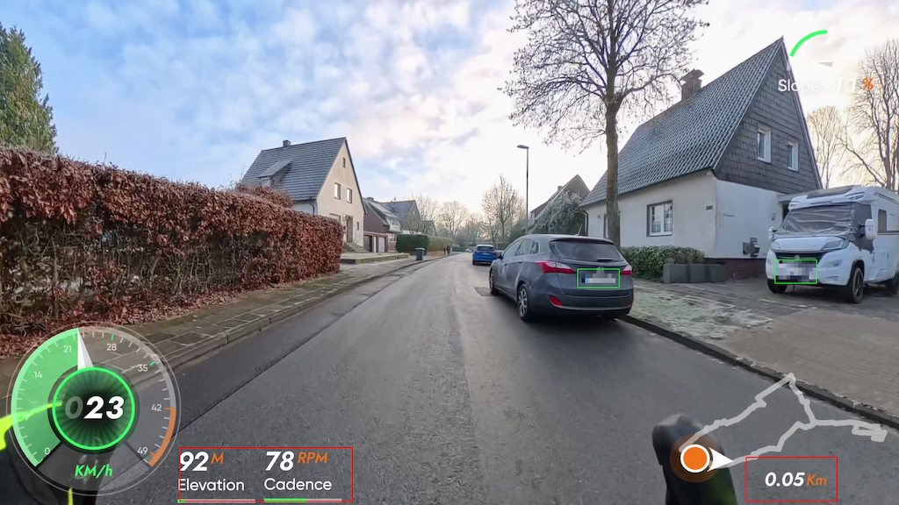
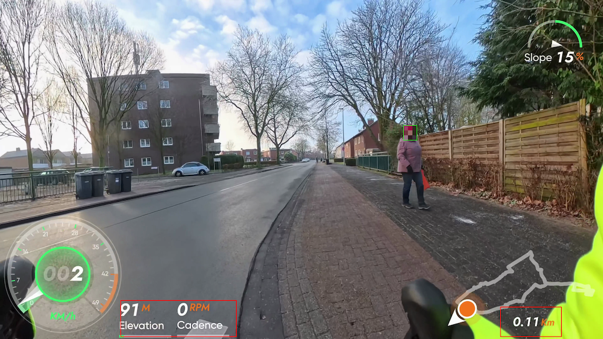

# DSGVO-Pixeler
Dieses Tool verarbeitet 4K-Videos lokal und anonymisiert automatisch Kfz-Kennzeichen und Gesichter mit YOLOv8 (Verpixeln oder Weichzeichnen). Optimiert fuer Apple Silicon (M-Serie) und Action-Cam-Footage, priorisiert es Datenschutz durch zuverlaessige Anonymisierung sensibler Bildinhalte bei Erhalt von Videoqualitaet und Audio.

## Demo (YouTube)
[](https://youtu.be/VYVoB2Qsij4)

## Projektseite
https://linuxlinusde.github.io/DSGVO-Pixeler/

## Voraussetzungen
- Python 3.10+
- ffmpeg via Homebrew: `brew install ffmpeg`
- Ein YOLOv8-Kennzeichenmodell als `.pt` Datei in `models/plates/` (z. B. `models/plates/best.pt`)
- Optional: Gesichtsmodelle in `models/faces/` (Default: alle .pt dort)
- Optional: Zusatzmodelle in `models/extra/` (nur wenn aktiviert via `--use_extra`)

## Setup
```bash
python3 -m venv .venv
source .venv/bin/activate
pip install -U pip
pip install -r requirements.txt
```

## Schnellstart (einfach)
1) Terminal im Projektordner oeffnen.
2) Virtuelle Umgebung aktivieren:
```bash
source .venv/bin/activate
```
3) Ausfuehren (Dateinamen anpassen):
```bash
python dsgvo-pixeler.py --input input.mp4 --output output.mp4 --weights models/plates/best.pt
```

Wenn dir Fehlermeldungen wie `ModuleNotFoundError: No module named 'cv2'` erscheinen, fehlt die Umgebung. Dann nutze die Setup-Schritte oben.

Hinweis: `--output` ist optional. Wenn du es weglasst, wird die Datei automatisch im gleichen Ordner wie das Input-Video erzeugt (mit Infos wie Weights, Preset und Timestamp im Namen). Du kannst bei einem einzelnen Video auch einen Zielordner angeben; dann erzeugt das Script den Dateinamen automatisch in diesem Ordner.

Du kannst auch einen Ordner, ein Glob-Muster oder eine kommagetrennte Liste als Quelle angeben. Dann verarbeitet das Script alle passenden `.mp4`-Dateien. Wenn `--output` gesetzt ist, muss es in diesem Fall ein Zielordner sein:
```bash
python dsgvo-pixeler.py --input /videos/source --output /videos/pixelt
python dsgvo-pixeler.py --input "/videos/source/*.mp4" --output /videos/pixelt
python dsgvo-pixeler.py --input a.mp4,b.mp4,c.mp4 --output /videos/pixelt
```

Wenn du ohne Parameter startest, zeigt das Programm eine kurze, leicht verstaendliche Hilfe an.

## Screenshots
Beispielhafte Ausgabe der Anonymisierung:




Hinweis: Die grünen Rahmen zeigen erkannte Objekte, die roten Rahmen die No-Pixel-Zonen; die Overlays sind optional und erscheinen nur mit `--debug_pixel` und `--debug_no_pixel`.

## Woher bekomme ich `models/plates/best.pt` (Kennzeichen)?
- Trainiere ein eigenes YOLOv8-Kennzeichenmodell und exportiere es als `.pt`.
- Nutze ein bestehendes Kennzeichen-Detektionsmodell von einem vertrauenswuerdigen Anbieter (achte auf Lizenz und Datenschutz).
- Beispiel: Ein passendes Modell gibt es z. B. hier: https://huggingface.co/Koushim/yolov8-license-plate-detection/tree/main (als `models/plates/best.pt` ablegen)
- Wichtig: Das Modell muss Kennzeichen als Objekte erkennen (keine OCR noetig).

## Gesichtsmodelle (Default)
- Standard: alle `.pt` Dateien in `models/faces/`.
- Alternativ: `--faces_weights models/faces/a.pt,models/faces/b.pt`
- Link fuer Gesichtsmodelle: https://github.com/lindevs/yolov8-face

## Funktionen
Ueberblick ueber alle Funktionen und was das Script im Hintergrund macht:

Erkennung
- Kennzeichen + Gesichter standardmaessig aktiv (YOLOv8). Abschaltbar mit `--no_plates` oder `--no_faces`.
- Standard: alle `.pt` Modelle in `models/plates/` und `models/faces/`.

Anonymisierung
- Auswahl zwischen Verpixelung (Mosaik) und Weichzeichnen: `--anonymize pixelate|blur` (Standard: blur).
- Verpixelung-Staerke: `--blocks_plates`, `--blocks_faces` (nur pixelate).
- Blur-Staerke: `--blur_ksize` (ungerade Kernel-Groesse).
- Optionaler Sicherheitsrand: `--pad`.

Tiling
- `--tiling N` teilt Frames in ein NxN Raster, verbessert kleine Kennzeichen.
- Tiling verlangsamt deutlich und deaktiviert Tracking. Default ist 2x2.

Tracking
- Standardmaessig aktiv, reduziert Flackern. Deaktivieren mit `--no_track`.
- Bei Tiling wird Tracking automatisch deaktiviert.

No‑Pixel‑Zonen
- Pixel-Zonen: `--no_pixel_zone_px1..4` (x1,y1,x2,y2 in Pixeln).
- `--debug_no_pixel` zeichnet die Zonen rot ein.

Snapshots
- `--snapshot_every` speichert JPEG-Snapshots alle N Minuten (standardmaessig im Ordner des Input-Videos).
- `--snapshot_size` steuert die Aufloesung (z. B. 1920x1080). Snapshot-Namen enthalten den gleichen Timestamp wie das Output-Video.
- `--snapshot_dir` legt den Ausgabeordner fest (Default: gleicher Ordner wie das Input-Video).

Performance
- `--work_w` reduziert die Arbeitsaufloesung fuer schnellere Erkennung.
- `--imgsz` steuert die YOLO-Inferenzgroesse.

Encoding und Audio
- ffmpeg encodiert das Video (VideoToolbox auf macOS, CPU-Fallback mit `--force_sw`).
- `--no_audio` entfernt die Audiospur.
- `--bitrate auto` uebernimmt die Input-Bitrate via ffprobe; alternativ fester Wert.
- `-movflags +faststart` fuer schnellen Start beim Streaming.

Logging
- Fortschritt mit Prozent und ETA, plus effektive FPS.
- Zusammenfassung am Ende mit Aufloesung, Bitrate, Encoder, Audio, Tracking, Tiling und Modellanzahl.

## Tiling
Tiling teilt jedes Frame in kleinere Kacheln (z. B. 2x2). Dadurch werden sehr kleine Kennzeichen in 4K+ besser erkannt, allerdings steigt die Rechenzeit, weil YOLO pro Kachel laeuft.

Hinweis: Tiling kann die Verarbeitung deutlich verlangsamen. Beispiel (MacBook M4, 5760x3240 @ 29.97 fps): 1798 Frames (~59s Video) dauerten 9m 36s bei 2x2 Tiling.

Tipp: Fuer schnelle Tests `--test_minutes 1`, `--preset fast` oder `--tiling 1` verwenden.

Hinweis: Snapshots erzeugen zusaetzliche CPU- und Festplatten-Last, fuer YouTube-Thumbnails meist vernachlaessigbar.

HEVC Default (4K, MPS, Audio wird uebernommen):
```bash
python dsgvo-pixeler.py \
  --input input.mp4 \
  --output output.mp4 \
  --weights /path/to/plate_model.pt
```

Weichzeichnen (zum Vergleich mit Verpixelung):
```bash
python dsgvo-pixeler.py \
  --input input.mp4 \
  --output output_blur.mp4 \
  --weights /path/to/plate_model.pt \
  --anonymize blur \
  --blur_ksize 80
```

H264 kompatibler Output (lauft fast ueberall, empfehle 50M fuer beste Qualitaet):
```bash
python dsgvo-pixeler.py \
  --input input.mp4 \
  --output output_h264.mp4 \
  --weights /path/to/plate_model.pt \
  --codec h264 \
  --bitrate 50M
```

Software-Encoding erzwingen (wenn Hardware-Encoding zickt):
```bash
python dsgvo-pixeler.py \
  --input input.mp4 \
  --output output_sw.mp4 \
  --weights /path/to/plate_model.pt \
  --force_sw
```

Audiospur entfernen:
```bash
python dsgvo-pixeler.py \
  --input input.mp4 \
  --output output_noaudio.mp4 \
  --no_audio
```

Nur Schnelltest mit kleinerer Arbeitsaufloesung (schneller, weniger genau):
```bash
python dsgvo-pixeler.py \
  --input input.mp4 \
  --output output_fast.mp4 \
  --weights /path/to/plate_model.pt \
  --work_w 1280
```

Balanced-Preset (schneller als der Standard quality):
```bash
python dsgvo-pixeler.py \
  --input input.mp4 \
  --output output_balanced.mp4 \
  --weights /path/to/plate_model.pt \
  --preset balanced
```

Weitere Beispiele (ausfuehrlich):
Nur Kennzeichen (Gesichter aus):
```bash
python dsgvo-pixeler.py --input input.mp4 --weights models/plates/best.pt --no_faces
```

Nur Gesichter (Kennzeichen aus):
```bash
python dsgvo-pixeler.py --input input.mp4 --faces_weights models/faces/face1.pt --no_plates
```

Mehrere Modelle (Plates + Faces):
```bash
python dsgvo-pixeler.py \
  --input input.mp4 \
  --weights models/plates/a.pt,models/plates/b.pt \
  --faces_weights models/faces/face1.pt,models/faces/face2.pt
```

Extra-Modelle zusaetzlich nutzen:
```bash
python dsgvo-pixeler.py --input input.mp4 --use_extra
```

Tiling fuer kleine Kennzeichen (2x2, Default):
```bash
python dsgvo-pixeler.py --input input.mp4 --tiling 2
```

Pixel-Zonen definieren und anzeigen:
```bash
python dsgvo-pixeler.py \
  --input input.mp4 \
  --no_pixel_zone_px1 120,1500,900,2160 \
  --no_pixel_zone_px2 3000,1500,3800,2160 \
  --debug_no_pixel
```

Testlauf (nur 2 Minuten, Debug-Overlay):
```bash
python dsgvo-pixeler.py --input input.mp4 --test_minutes 2 --debug_pixel
```

Snapshots alle 5 Minuten (Full-HD):
```bash
python dsgvo-pixeler.py --input input.mp4 --snapshot_every 5 --snapshot_size 1920x1080
```

Beispiele aus der Praxis

Minimaler Lauf mit Defaults (Weights automatisch aus `models/plates/`/`models/faces/`):
```bash
python dsgvo-pixeler.py --input source.mp4
```

Mehrere MP4-Dateien verarbeiten (Ordner, Glob oder Liste):
```bash
python dsgvo-pixeler.py --input /videos/source --output /videos/pixelt
python dsgvo-pixeler.py --input "/videos/source/*.mp4" --output /videos/pixelt
python dsgvo-pixeler.py --input a.mp4,b.mp4,c.mp4 --output /videos/pixelt
```

Schneller Testlauf mit zwei No-Pixel-Zonen und visuellem Debug (nur 1 Minute):
```bash
python dsgvo-pixeler.py \
  --input source.mp4 \
  --preset fast \
  --no_pixel_zone_px1 990,2796,1382,3211 \
  --no_pixel_zone_px2 368,3026,616,3118 \
  --test_minutes 1 \
  --debug_pixel \
  --debug_no_pixel
```

Laengerer Test mit Snapshots und Tiling, Audio entfernt (5 Minuten):
```bash
python dsgvo-pixeler.py \
  --input source.mp4 \
  --preset fast \
  --no_pixel_zone_px1 990,2796,1382,3211 \
  --no_pixel_zone_px2 368,3026,616,3118 \
  --test_minutes 5 \
  --no_audio \
  --debug_pixel \
  --debug_no_pixel \
  --tiling 1 \
  --snapshot_every 1 \
  --snapshot_size 1920x1080
```

Kurzer Snapshot- und Debug-Run ohne No-Pixel-Zonen (1 Minute):
```bash
python dsgvo-pixeler.py \
  --input source.mp4 \
  --preset fast \
  --test_minutes 1 \
  --no_audio \
  --debug_pixel \
  --tiling 1 \
  --snapshot_every 1 \
  --snapshot_size 1920x1080
```

Preset im Output-Ordner speichern und fuer ein anderes Video wiederverwenden:
```bash
python dsgvo-pixeler.py --input source.mp4 --save_preset json
python dsgvo-pixeler.py --input another.mp4 --load_preset source_preset
```
Preset-Namen leiten sich vom Input-Dateinamen ab (z. B. `source.mp4` -> `source_preset.json`).

## Wichtige Parameter
- `work_w`: Arbeitsbreite fuer Detektion (0 = Originalaufloesung). Default: 0. Empfohlen: 0-3840.
- `imgsz`: YOLO Inferenzgroesse (groesser = bessere Erkennung, aber langsamer). Default: 1600. Empfohlen: 640-2048.
- `conf`: Confidence Threshold (niedriger = mehr Treffer). Default: 0.2. Empfohlen: 0.1-0.6.
- `blocks_plates`: Pixelblock-Groesse fuer Kennzeichen (groesser = grober). Default: 16. Empfohlen: 4-64.
- `blocks_faces`: Pixelblock-Groesse fuer Gesichter (groesser = grober). Default: 24. Empfohlen: 4-64.
- `blocks`: deprecatedes Alias fuer `blocks_plates`. Empfohlen: 4-64.
- `pad`: Sicherheitsrand in Pixeln um jede Box. Default: 24. Empfohlen: 0-100.
- `no_pixel_zone_px1..4`: Bis zu vier No-Pixel-Zonen in Pixeln als `x1,y1,x2,y2` (oben links -> unten rechts).
- Tipp: Nutze den eingebauten Command-Builder, um No-Pixel-Zonen lokal zu bestimmen: `docs/command-builder.html`
- Gehostete Version: https://linuxlinusde.github.io/DSGVO-Pixeler/command-builder.html
- `force_sw`: Software-Encoding erzwingen (nuetzlich, wenn VideoToolbox zickt).
- `test_minutes`: Nur die ersten N Minuten verarbeiten (0 = alles). Default: 0. Empfohlen: 0-60.
- `preset`: `fast`, `balanced`, `quality` fuer einfache Speed/Qualitaets-Wahl. Default: `quality`.
- `anonymize`: `pixelate` oder `blur` (Standard: `blur`).
- `blur_ksize`: Blur-Staerke (gerade Werte werden auf ungerade aufgerundet).
- `debug_pixel`: Zeichnet gruene Boxen zur Kontrolle ins Video.
- `debug_no_pixel`: Zeichnet die No-Pixel-Zonen rot ins Video.
- `no_audio`: Entfernt die Audiospur im Output.
- `no_track`: Tracking deaktivieren (Tracking ist standardmaessig aktiv).
- `tiling`: Frame in Kacheln teilen fuer kleine Objekte (1-10). Default: 2. Empfohlen: 1-4.
- `snapshot_every`: Snapshot alle N Minuten speichern (0 = aus). Default: 1. Empfohlen: 0-60.
- `snapshot_dir`: Ausgabeordner fuer Snapshots (Default: Input-Ordner).
- `snapshot_size`: Snapshot-Groesse, z. B. 1920x1080.
- `bitrate`: Standard ist `auto` (uebernimmt Bitrate vom Input), alternativ z. B. `50M`.
- `log_every`: Log-Ausgabe alle N Frames. Default: 200. Empfohlen: 50-1000.
- `save_preset`: Speichert verwendete Parameter im Output-Ordner als `*_preset.json`/`.txt`.
- `load_preset`: Preset-JSON per Dateipfad oder Name laden (relativ zu Input/Output-Ordner).
- `faces_weights`: Liste der Gesichtsmodelle (Default: alle in `models/faces/`).
- `weights`: Liste der Kennzeichenmodelle (Default: alle in `models/plates/`).
- `extra_weights`: Liste zusaetzlicher Modelle (oder `--use_extra` fuer `models/extra/`).
- `no_faces`: Gesichter nicht anonymisieren.
- `no_plates`: Kennzeichen nicht anonymisieren.

## Bedienung in einfachen Worten
1) Lege dein Video (z. B. `input.mp4`) in den Projektordner und die Gewichte in `models/plates/` (z. B. `models/plates/best.pt`).
2) Oeffne ein Terminal im Projektordner.
3) Starte das Programm wie im Schnellstart gezeigt.
4) Danach findest du die Ausgabe als `output.mp4` im selben Ordner.
Tipp: Wenn `models/plates/` Modelle enthalten und du `--weights` vergisst, werden sie automatisch genutzt.

## FAQ
Werden mehrere Modelle parallel verarbeitet?
Nein, sie laufen nacheinander (stabiler und oft schneller).

Ist Tracking standardmaessig aktiv?
Ja. Mit `--no_track` kannst du es deaktivieren.

Warum ist Tracking bei Tiling deaktiviert?
Tracking ueber Kacheln ist unzuverlaessig, weil Objekt-IDs nicht konsistent zwischen den Tiles gematcht werden koennen. Daher deaktiviert das Tool Tracking bei Tiling.

Was ist der Standardwert fuer Tiling?
`--tiling` steht standardmaessig auf `2` (2x2 Tiling).

## Hinweis zu Insta360
Empfehlung: In Insta360 Studio zuerst reframen/flat exportieren (16:9), dann mit diesem Tool anonymisieren.

## Troubleshooting
VideoToolbox Fehler -12908 (HW-Encoding schlaegt fehl): Ursache ist oft Pixel-Format-Negotiation. Stelle sicher, dass ein VT-kompatibles Format (nv12) genutzt wird. Das Script setzt dies automatisch fuer VideoToolbox. Falls es dennoch scheitert, teste per ffmpeg:
```bash
ffmpeg -y -f lavfi -i testsrc2=size=3840x2160:rate=60 -t 2 -vf format=nv12 -c:v hevc_videotoolbox -b:v 12M vt_test.mp4
```

Rotation wirkt falsch: Manche Dateien haben Rotations-Metadaten. Normalisieren via ffmpeg:
```bash
ffmpeg -i input.mp4 -vf "transpose=0" -c:a copy normalized.mp4
```

Variable Framerate: Empfohlen ist eine Normalisierung vorab:
```bash
ffmpeg -i input.mp4 -vsync cfr -r 25 -c:v libx264 -c:a copy normalized.mp4
```

## Datenschutz-Hinweis
Ziel ist Unlesbarkeit. Nutze grobe Pixel (`blocks` klein) und ausreichend `pad`, damit nichts uebersehen wird.

## Lizenz und Drittkomponenten
Der eigene Quellcode von DSGVO-Pixeler steht unter der MIT-Lizenz. Laufzeit-Abhaengigkeiten, externe Tools und Modellgewichte sind separat lizenziert.

Wichtige Hinweise:
- `ultralytics` / YOLO kann der AGPL-3.0 oder einer Ultralytics Enterprise License unterliegen.
- Wenn du DSGVO-Pixeler zusammen mit Ultralytics YOLO weitergibst oder bereitstellst, bist du fuer die Einhaltung der jeweils geltenden Ultralytics-Lizenzbedingungen verantwortlich.
- ffmpeg ist eine externe Abhaengigkeit und wird nicht mitgeliefert. Bitte installiere ffmpeg separat und beachte dessen Lizenzbedingungen (LGPL/GPL je nach Build).
- YOLO `.pt` Modellgewichte sind nicht von der MIT-Lizenz von DSGVO-Pixeler abgedeckt, sofern die jeweiligen Rechteinhaber sie nicht ausdruecklich unter kompatiblen Bedingungen veroeffentlichen.

Siehe `THIRD_PARTY_NOTICES.md` fuer die Uebersicht der Abhaengigkeiten.
